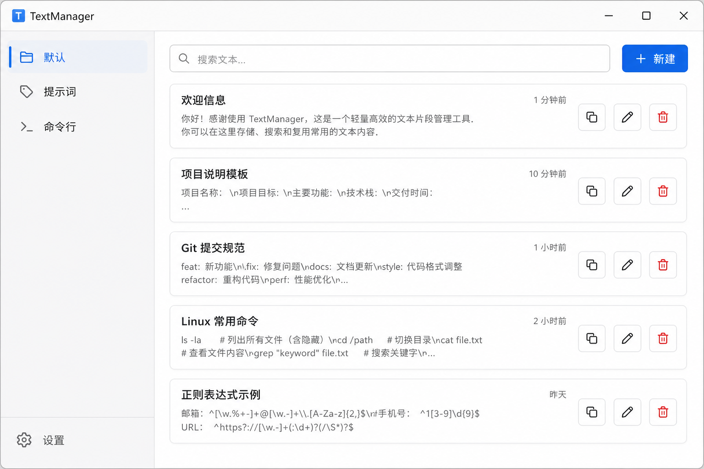
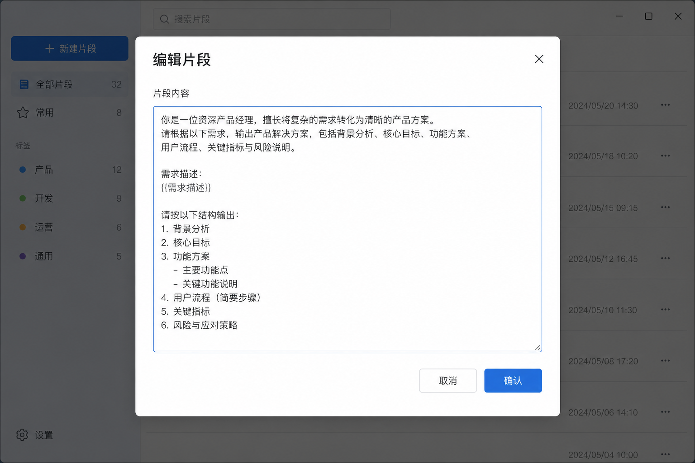
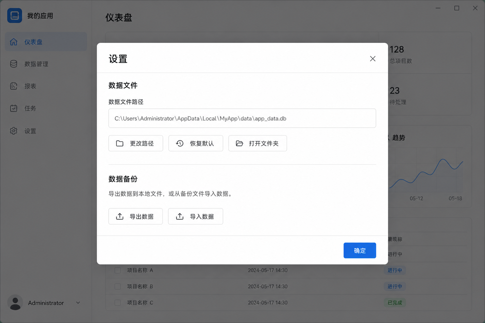

# TextManager

轻量 Windows 桌面文本管理工具，适合管理 AI 提示词、常用命令行、文件路径等文本片段。

## 下载

前往 [Releases](https://github.com/gao-shu/text-manager/releases) 页面，下载 **`TextManager-vX.X.X-windows-x64.exe`** 即可。

> 请只下载 `.exe` 文件。Release 页面上的 Source code (zip / tar.gz) 是 GitHub 自动附带的源码归档，普通使用无需下载。

双击 exe 运行，无需安装。

## 界面概览



- **左侧**：分类列表，底部 ⚙ **设置**
- **右侧**：片段列表，每条显示正文前两行预览

## 快速上手

### 1. 管理分类

- 点击左上角 **+ 新建** 添加分类（如「提示词」「命令行」）
- 单击分类切换当前列表
- 双击分类名称可重命名；悬停显示 **改 / 删**

### 2. 管理片段

- 点击 **+ 新建** 创建片段，在弹窗中输入内容后点 **确认**
- **单击** 片段：选中（高亮）
- **双击** 片段：打开编辑
- 右侧按钮：**复制 → 编辑 → 删除**



### 3. 搜索

顶部搜索框按 **正文内容** 实时过滤当前分类下的片段。

### 4. 快捷键

| 操作 | 快捷键 |
|------|--------|
| 复制选中片段 | `Ctrl + C` |
| 删除选中片段 | `Delete`（需确认） |

## 设置

点击左下角 **⚙ 设置** 打开：



| 功能 | 说明 |
|------|------|
| 数据文件路径 | 查看当前数据存储位置 |
| 更改路径 | 指定其他 JSON 文件作为数据文件 |
| 恢复默认 | 恢复为 `%APPDATA%/TextManager/data.json` |
| 打开文件夹 | 在资源管理器中打开数据目录 |
| 导出数据 | 备份为 JSON 文件 |
| 导入数据 | 从 JSON 文件恢复（覆盖当前数据） |

## 数据存储

默认数据文件位置：

```
%APPDATA%/TextManager/data.json
```

数据保存在本机，无需联网、无需账号。建议定期通过 **设置 → 导出数据** 备份。

## 常见问题

**Q：关闭窗口后数据还在吗？**  
A：在。所有操作自动保存到本地 JSON 文件。

**Q：换电脑怎么迁移？**  
A：在旧电脑 **导出数据**，在新电脑安装后 **导入数据** 即可。

**Q：Release 里除了 exe 还有 zip，要下载吗？**  
A：不需要。普通用户只下载 `TextManager-...-windows-x64.exe`。
